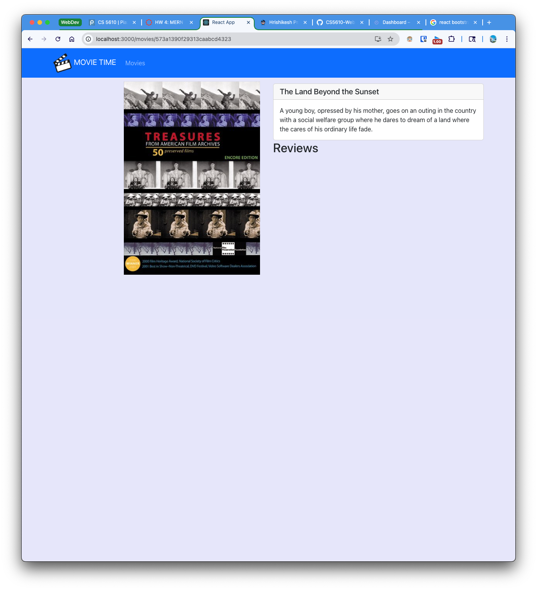

# MERN Stack Project Frontend

## Deployment
- Deployed Frontend: https://movie-time-hsp.uw.r.appspot.com
- Deployed Backend: https://new-mt-backend.uw.r.appspot.com/api/v1/movies
- Frontend Repository: https://github.com/CS5610-WebDev-Summer25/mern-stack-project-frontend-hspgit
- Backend Repository: https://github.com/CS5610-WebDev-Summer25/mern-stack-project-backend-hspgit

## HW 8: MERN Project Part 7
- Made folders for components to better organize the code.
- Added a zoom effect to the movie card on hover.
- Added different CSS files and class names to the components (different from the one provided 
  in assignment).

## HW 6: MERN Project Part 5

### Home page with favorites:

### Mongo-Fav Collection:

## HW 5: MERN Project Part 4

### New Review added:

### Delete Review:

## HW 4: MERN Project Part 3
### Tasks done:
- This is the frontend part of a MERN stack project. 
- It is built using React and connects to a backend server.
- I built the movie list home page.
- I built the movie details page showing the reviews.
- Completed the movie details page with the original poster and a placeholder poster if the 
  original is not available.
- I also wrote tests for the components using React Testing Library.

### Movie List Home Page:

### Movie Details Page with original poster:

### Movie Details Page with placeholder poster:\

### Testing:
